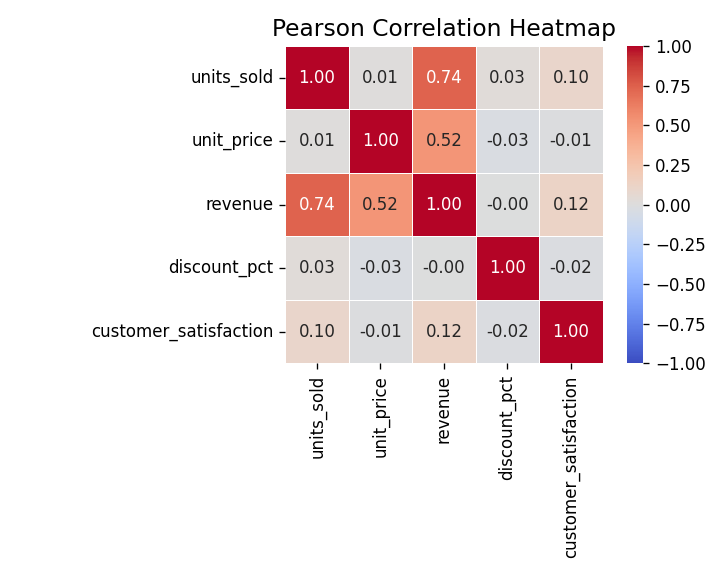
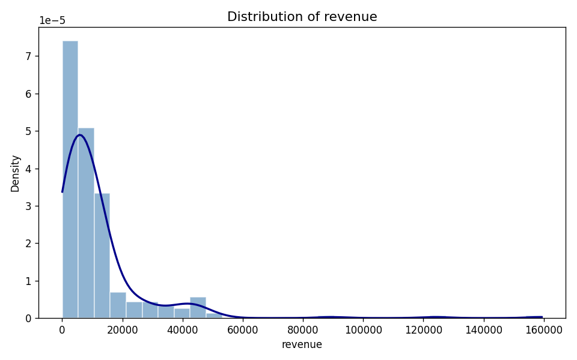
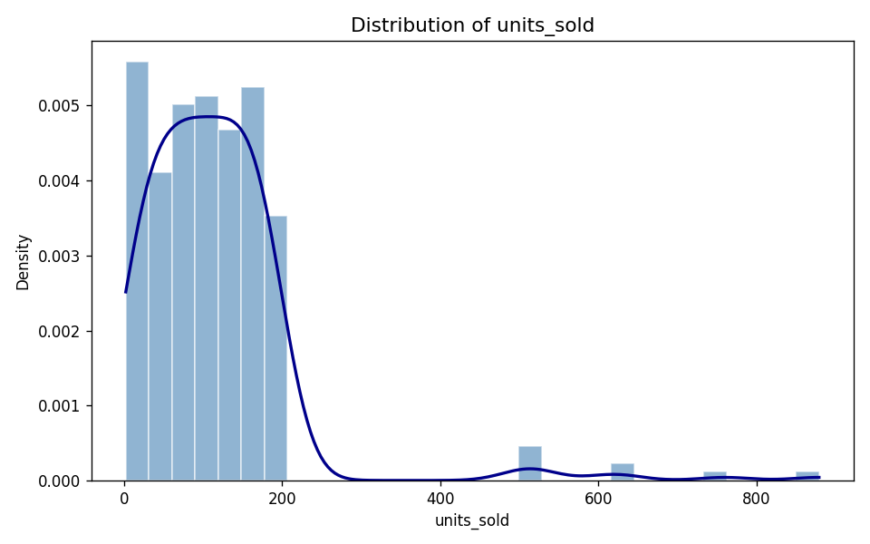
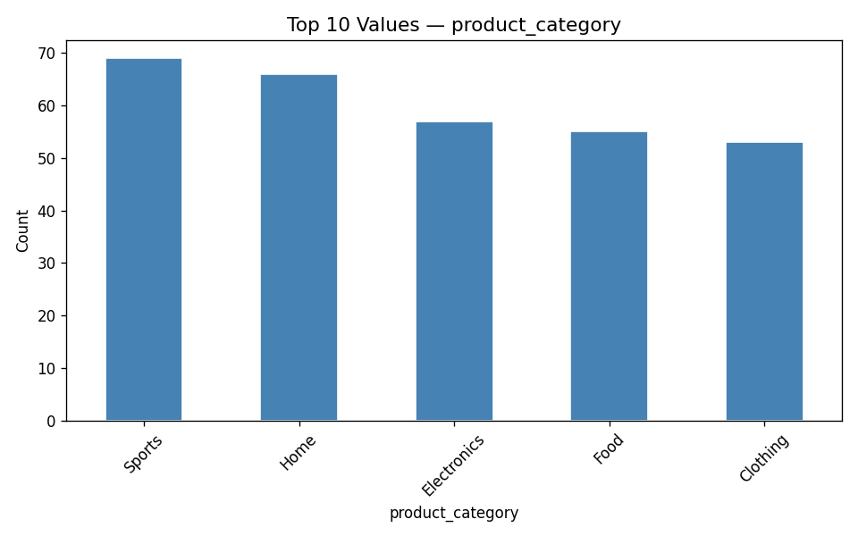
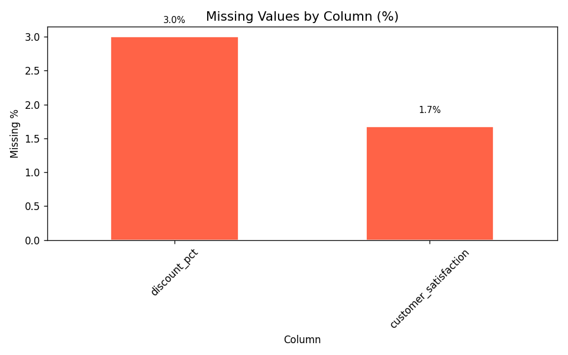

<div align="center">

# 🔬 Datalyst Agent

### Autonomous CSV Data Analysis — Powered by AI

[](https://python.org)
[](https://github.com/huggingface/smolagents)
[](https://ai.google.dev)
[](LICENSE)

**Drop in any CSV. Get a full analysis report, charts, and insights — automatically.**

*The agent writes and executes its own Python code to explore your data.*

</div>

---

## What Is This?

**Datalyst Agent** is an agentic data analysis pipeline built on [smolagents](https://github.com/huggingface/smolagents) (HuggingFace) and **Google Gemini 2.5 Flash**. You point it at a CSV file; it autonomously runs through a complete analysis protocol — writing and executing pandas code at each step, generating matplotlib/seaborn charts, and producing a structured written report.

> **The key differentiator:** smolagents' `CodeAgent` doesn't just *describe* what to do — it *writes Python code* as its action and *executes it live*. Every step is a real Thought → Code → Observation loop running in a sandboxed interpreter.

---

## Sample Output

*The following charts were generated autonomously by the agent on the bundled sales dataset:*

<table>
  <tr>
    <td align="center"><b>Correlation Heatmap</b></td>
    <td align="center"><b>Revenue Distribution</b></td>
  </tr>
  <tr>
    <td></td>
    <td></td>
  </tr>
  <tr>
    <td align="center"><b>Units Sold — Outlier Detection</b></td>
    <td align="center"><b>Product Category Breakdown</b></td>
  </tr>
  <tr>
    <td></td>
    <td></td>
  </tr>
  <tr>
    <td align="center" colspan="2"><b>Missing Values Overview</b></td>
  </tr>
  <tr>
    <td align="center" colspan="2"></td>
  </tr>
</table>

---

## How It Works

The agent follows an 11-step analysis protocol, end-to-end, without any human intervention:

```
Step 1  →  Load CSV            shape, dtypes, missing value counts
Step 2  →  Schema detection    classify each column: numeric / categorical / datetime / text
Step 3  →  Descriptive stats   mean, median, std, min, max, Q1, Q3, skewness, kurtosis
Step 4  →  Outlier detection   IQR method for every numeric column
Step 5  →  Value counts        top-N frequency analysis for every categorical column
Step 6  →  Correlation matrix  Pearson correlations across all numeric columns
Step 7  →  Histograms          distribution + KDE overlay per numeric column → PNG
Step 8  →  Heatmap             annotated correlation heatmap → PNG
Step 9  →  Bar charts          top-N category frequencies → PNG
Step 10 →  Missing values      missing % per column → PNG
Step 11 →  Summary report      structured analysis_summary.txt with all findings
```

The terminal streams every step live:

```
━━━━━━━━━━━━━━━━━━━━━━━━━━━━━━━━━━━━ Step 4 ━━━━━━━━━━━━━━━━━━━━━━━━━━━━━━━━━━━━
 ─ Executing parsed code: ──────────────────────────────────────────────────────
  for col in numeric_columns:
      outliers = detect_outliers_iqr(filepath=csv_filepath, column=col)
      print(outliers)
 ───────────────────────────────────────────────────────────────────────────────
Execution logs:
{"column": "units_sold", "outlier_count": 8, "outlier_pct": 2.67,
 "outlier_sample": [506, 523, 501, 879, 522, 760, 616, 625]}
[Step 4: Duration 12.31 seconds | Input tokens: 26,447 | Output tokens: 1,438]
```

---

## Tech Stack

| Layer | Technology |
|---|---|
| **Agent framework** | [smolagents](https://github.com/huggingface/smolagents) `CodeAgent` |
| **LLM** | Google Gemini 2.5 Flash via [LiteLLM](https://github.com/BerriAI/litellm) |
| **Data** | pandas, numpy |
| **Visualizations** | matplotlib, seaborn |
| **Config** | python-dotenv |

---

## Project Structure

```
datalyst-agent/
│
├── data/
│   ├── sales_data.py         # 300-row sales dataset (regions, revenue, reps)
│   ├── weather_data.py       # 365-row weather dataset (5 cities, seasonal temps)
│   └── population_data.py    # 150-row population dataset (6 continents, GDP)
│
├── tools/
│   ├── data_tools.py         # load_csv_file, get_column_schema
│   ├── stats_tools.py        # descriptive stats, IQR outliers, value counts, correlation
│   ├── chart_tools.py        # histograms, heatmap, bar charts, missing value chart
│   └── summary_tools.py      # write_analysis_summary
│
├── docs/images/              # Sample charts (committed for README)
├── agent.py                  # CodeAgent + ThrottledLiteLLMModel config
├── main.py                   # CLI entry point
├── requirements.txt
└── .env                      # Your API key (not committed)
```

---

## Getting Started

### 1. Clone and install

```bash
git clone https://github.com/yourusername/datalyst-agent.git
cd datalyst-agent

python3 -m venv venv
source venv/bin/activate        # Windows: venv\Scripts\activate
pip install -r requirements.txt
```

### 2. Set your API key

```bash
# Create a .env file
echo "GEMINI_API_KEY=your_key_here" > .env
```

Get a free key at [Google AI Studio](https://aistudio.google.com/app/apikey).

### 3. Run

```bash
# Analyze a bundled demo dataset
python main.py --demo sales
python main.py --demo weather
python main.py --demo population

# Analyze your own CSV
python main.py --csv path/to/your/data.csv

# Custom output directory
python main.py --demo sales --output my_results/

# Generate demo CSVs without running analysis
python main.py --generate-demos
```

### Output

Each run creates a timestamped output directory:

```
outputs/sales_data_analysis/
├── analysis_summary.txt
├── correlation_heatmap.png
├── hist_units_sold.png
├── hist_unit_price.png
├── hist_revenue.png
├── hist_discount_pct.png
├── hist_customer_satisfaction.png
├── bar_region.png
├── bar_product_category.png
├── bar_sales_rep.png
└── missing_values.png
```

---

## Demo Datasets

All datasets are synthetically generated — no external downloads required.

| Dataset | Rows | Notable Features |
|---|---|---|
| **Sales** | 300 | 4 regions · 5 product categories · 8 sales reps · **intentional outliers** in `units_sold` (500–900 range) · **~5% missing** in `discount_pct` |
| **Weather** | 365 | 5 cities · sinusoidal seasonal temperatures · exponential precipitation distribution · sparse NaNs |
| **Population** | 150 | 30 countries · 6 continents · right-skewed population · GDP correlated with continent |

The intentional outliers and missing values are there to verify the agent actually finds them.

---

## Architecture

```
                          ┌─────────────────────────────────┐
   main.py ──► agent.py  │         CodeAgent Loop           │
                          │                                 │
                          │  ┌──────────┐  ┌────────────┐  │
                          │  │  Gemini  │  │  11 Tools  │  │
                          │  │ 2.5 Flash│  │ (pandas /  │  │
                          │  │(LiteLLM) │  │  mpl / sns)│  │
                          │  └────┬─────┘  └─────┬──────┘  │
                          │       │               │         │
                          │   Thought ──► Code ──► Observe  │
                          │       └───────────────┘         │
                          └─────────────────────────────────┘
```

Each tool is a plain Python function decorated with `@tool`. The agent decides which tools to call, writes the code to call them, and adapts based on the output — no rigid orchestration required.

---

## Requirements

- Python 3.10+
- Google Gemini API key

```
smolagents>=1.24.0
litellm>=1.50.0
pandas>=2.0.0
numpy>=1.26.0
matplotlib>=3.8.0
seaborn>=0.13.0
python-dotenv>=1.0.0
```
